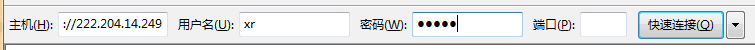

# server-config

:)

# 	服务IP:<prefix>.14.65（PREFIX代表校园前缀） 

## no any alternative  

当出现不抗力因素导致服务器失效并重启时，请使用本repo中的detect.py来查询最新的服务器IP

*Usage*

```
$ python3 detect.py
```

detect.py依赖requests，请在本机使用前使用

```
$ pip install requests -i https://pypi.douban.com/simple
```

安装这个依赖，否则操作可能会无法执行

# 如何使用

windows下推荐使用putty进行操作，下载后输入服务器IP，端口22既可进入，进入后请输入用户名以及密码进入

Linux中使用

```
$ ssh <user>@<server-ip>
```

服务器开通了SFTP，可进行文件的上传下载操作，未开通ftp，请安装filezilla来进行文件的上传。



linux用户请使用scp指令。具体请man

出于安全考虑， 请不要使用root作为用户登录。我设定了两个初始用户

- user：root password:123456
- user: pubuser password:123456

第一次使用时，你可以使用pubuser登录进入ssh，使用

```bash
$ sudo adduser <user>
```

来添加自己使用的用户，随之使用

```
$ sudo visudo
```

编辑配置文件，为自己加入sudo权限

# UTIL

- SSH secure shell 为远程访问shell，linux中，所有的操作都需要基于shell展开

- $,# : $为普通用户和ROOT用户分别在shell中的操作，在代码块中的代码，请去掉$,#来进行输入

- ~代表当前用户目录 echo ~ = /home/<username>

- linux中有非常系统级和用户级的配置文件，例如/etc/bash.bashrc和~/.bashrc。在可以的情况下，请尽量用户级的配置以免影响到他人。在实在无法避免的情况下，请对相关文件进行备份。

  我使用bashrc进行解释

  ```
  $ sudo cp /etc/bash.bashrc /etc/bash.bashrc.bak
  ```

  随后进行操作

  ```
  $ sudo vim /etc/bash.bashrc
  ```

- 服务器的系统是ubuntu 16.04，请使用针对ubuntu 16.04的教程，不同的系统、不同的版本内核不同，错误的指令可能造成不必要的麻烦

- ubuntu的包管理工具是apt-get ，安装软件请使用

  ```
  $ sudo apt-get install <software-name>
  ```

  而ubuntu是debian系的操作系统，因此你也可以使用.deb的文件来安装软件

  ```
  $ sudo dpkg -i  <software-name>.deb && sudo apt install -f
  ```

- 当你在教程中看见了gedit这种指令，ssh是无法执行这种指令的。这只是一个编辑器，请将gedit替换成vim或nano。推荐新入linux的用户选择nano

- 当命令提示缺少权限时，请斟酌使用sudo进行操作

- 不懂的指令请man. e.g.

  ```
  $ man cd
  ```

# ISSUE

- 部分细节未做描述，遇到我未说明白的请直接咨询我

- 我使用docker搭建了翻墙服务，速度一般，延迟低。斟酌使用，由于日方docker不再免费，所以不再可以使用

  ~~https://github.com/ongstan/S-~~

- todolist中的软件正在逐步安装

- 我也在服务器上搭建了云盘同步盘的服务。你也可以使用

  http://<server-ip>:8000 进入云盘查看

  如果需要使用请联系我

# TODOLIST

- ~~nvidia driver~~
- tensorflow-GPU version
- caffe
- cuda,cudnn
- keras
- ...


# SEAFILE Startup

seafile 文件在用户stan目录下

即 /home/stan/,使用stan用户远程登录，密码为我的名字

通常情况下，如果服务器的ip地址没有变化，你不用执行这一步操作

` $ nano /home/stan/rhtm/conf/ccnet.conf`

将服务器ip变更为当前服务器ip

随后切换目录

`$ cd /home/stan/rhtm/seafile-server-6.1.0 `

清除seafile错误缓存

` $ sudo rm -rf /tmp/seahub_cache -r `

随后按顺序启动

` $ ./home/stan/rhtm/seafile-server-6.1.0/seafile.sh`

`$ ./home/stan/rhtm/seafile-server-6.1.0/seahub.sh `

提示成功即完成

